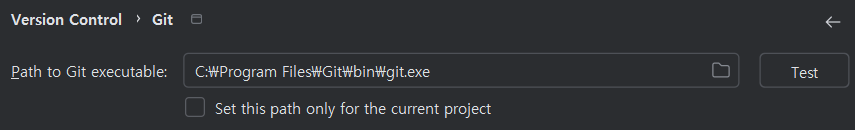
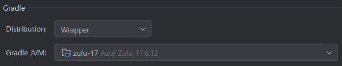
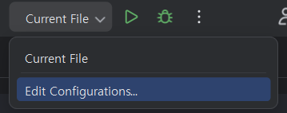
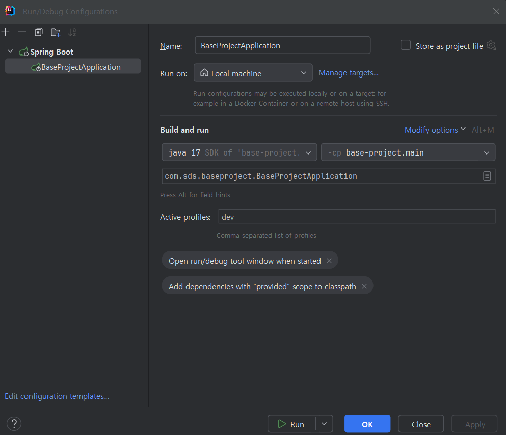
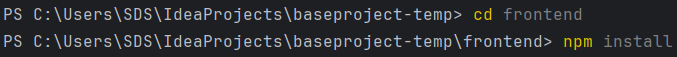
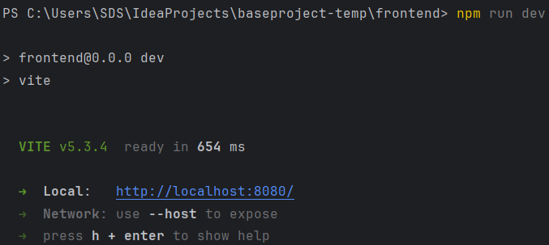

# Base Project

> Base Project는 교육생에게 제공되는 예제 프로젝트로서, SSAFY가 제공하는 OPEN API를 빠르게 적용할 수 있도록 개발 템플릿을 제공합니다.

## 📌 목차

- [ 실행 환경 (권장) ](#-실행-환경-권장)
- [ 실행 환경 구성 방법 ](#-실행-환경-구성-방법)
- [ 로컬 프로젝트 실행 ](#-로컬-프로젝트-실행)
- [ 테이블 명세 ](#-테이블-명세)

## ⚙ 실행 환경 (권장)

아래 작성된 버전으로 테스트하였습니다. 이외 버전은 별도의 테스트가 필요하며 확인 후에 사용하시기 바랍니다.

### IDE

| 구분 |        IntelliJ IDEA        |
|:--:|:---------------------------:|
| 버전 | 2024.1.3 (Ultimate Edition) |

### 개발 환경

| 구분 | JDK | Spring Boot | Gradle | Node.js | Vue.js | Vuetify |
|:--:|:---:|:-----------:|:------:|:-------:|:------:|:-------:|
| 버전 | 17  |    3.3.0    |  8.7   | 20.16.0 | 3.4.31 | 3.6.13  |

### DBMS

| 구분 | MariaDB (로컬) | MySQL (AWS 클라우드) |
|:--:|:----------------:|:----------------:|
| 버전 | 10.2.44        |      8.0.39      |

※ querydls-jpa 연동

### Browser

Vuetify3이 지원하는 Browser 버전 목록입니다. ([자세히](https://vuetifyjs.com/en/getting-started/browser-support/#browsers))

|  구분   | Chromium<br>(Chrome, Edge) | Firefox 88 | Safari 15 | Edge <79 | Internet Explorer |
|:-----:|:--------------------------:|:----------:|:---------:|:--------:|:-----------------:|
| 지원 여부 |             O              |     O      |     O     |    X     |         X         |

## 🛠 실행 환경 구성 방법

### Git

아래 링크에 접속하여 최신 버전으로 설치 파일을 다운로드하고 실행합니다.

| 구분  | 링크                   |
|-----|----------------------|
| Git | https://git-scm.com/ |

### IntelliJ IDEA

아래 링크에 접속하여 권장 버전으로 설치 파일을 다운로드하고 실행합니다.

| 구분            | 링크                                    |
|---------------|---------------------------------------|
| IntelliJ IDEA | https://www.jetbrains.com/ko-kr/idea/ |

### Java

Base Project의 Backend는 Java를 이용하여 Spring Boot 기반으로 구성되었습니다. Backend 개발 및 빌드를 위해 Java가 필요합니다.

1. 설치

   아래 링크에 접속하여 사용 중인 OS에 맞는 설치 파일을 다운로드하고 실행합니다.

| 구분       | 링크                                                                   |
|----------|----------------------------------------------------------------------|
| Open JDK | https://www.azul.com/downloads/?version=java-17-lts&package=jdk#zulu |

2. 환경변수 설정

   설치한 Java가 모든 경로에서 실행되도록 환경변수를 설정합니다.

| 환경변수 명    | 값               |
|-----------|-----------------|
| JAVA_HOME | JDK 설치 경로       |
| PATH      | %JAVA_HOME%\bin |

### Node.js

Base Project의 Frontend는 Node.js를 이용하여 Vue.js 기반으로 구성되었습니다. Frontend 구동에 필요한 라이브러리 관리, 빌드 등을 수행하기 위해 Node.js 설치가 필요합니다.

아래 링크에 접속하여 사용 중인 OS에 맞는 설치 파일을 다운로드하고 실행합니다.

| 구분                | 링크                                            |
|-------------------|-----------------------------------------------|
| Node.js v.20.16.0 | https://nodejs.org/download/release/v20.16.0/ |


## 💿 로컬 프로젝트 실행

### 1. 프로젝트 설정

#### 1) Git 설정

IntelliJ > File > Settings > Version Control > Git 설정에서 설치한 경로를 입력합니다.

(설치한 위치에 따라 개인별로 경로가 다를 수 있습니다.)



#### 2) 프로젝트 Clone

IntelliJ > File > New > Project From Version Control을 선택합니다.

| 구분        | 값                                                |
|-----------|--------------------------------------------------|
| URL       | https://lab.ssafy.com/ssafy-app/baseproject.git  |
| Directory | 프로젝트 다운로드 경로                                     | 

#### 3) JDK 설정

IntelliJ > File > Settings > Build, Execution, Deployment > Build Tools > Gradle 설정에서 설치한 JDK를 선택합니다.
만약 설치한 JDK가 보이지 않는다면 환경변수 설정이 제대로 되었는지 확인하세요.



#### 4) Build 옵션 설정

IntelliJ > File > Settings > Build, Execution, Deployment > Compiler > Annotation Processors 설정에서 Enable Annotation processing 체크박스를 활성화 확인

##### Annotation Processor란?

Annotation Processor는 컴파일 단계에서 Annotation에 정의된 일렬의 프로세스를 동작하게 하는 것을 의미합니다.
컴파일 단계에서 실행되기 때문에, 빌드 단계에서 에러를 출력하게 할 수 있고, 소스코드 및 바이트 코드를 생성할 수 도 있습니다.

##### Lombok이란?

@Getter, @Setter, @Builder 등의 Annotation과 Annotation Processor를 제공하여 표준적으로
작성해야 할 코드를 개발자 대신 생성해주는 라이브러리 입니다.
컴파일 시점에 Annotation Processor를 사용하여 abstract syntaxtree를 조작합니다.

### 2.  Backend 설정

#### 1) Spring Profile 설정
Spring Boot는 외부 설정([Externalized Configuration](https://docs.spring.io/spring-boot/reference/features/external-config.html#features.external-config.files))
을 통해 애플리케이션에서 사용하는 여러 설정 값을 정의하는 기능을 제공합니다.

Base Project는 그 중 `src/main/resources` 폴더 내 `*.properties`을 통해 애플리케이션 설정 값을 정의하였습니다.

`application.properties` 파일에서 key-value 형식으로 설정 값을 정의하며, 서버 포트, JWT 설정, 데이터베이스 등 프로젝트 공통 설정 값을 정의할 수
있습니다. ([자세히](https://docs.spring.io/spring-boot/appendix/application-properties/index.html))

`application-env[dev|stage|prod|aws|azure].properties` 파일에서는 실행 환경에 따라 설정 값이 다른 경우 실행 환경 별 독립 된 값을 설정하여 개발환경부터 운영환경까지 통합 프로젝트로 개발이 가능합니다.

`base project`에서는 개발과 운영 환경을 고려하여 환경 별 설정 파일을 정의 하였습니다.
1. `dev` : 개발자 PC 환경을 고려한 설정 파일로, DB, Redis Cache등을 개발자 직접 PC 내 설치하거나, 설정 값 변경을 통해 프로젝트 교보재로 제공 받은 EC2를 포함, 클라우드 리소스를 활용한 개발 환경까지 고려 할 수 있습니다.
2. `stage` : SUPER APP 프로젝트 참가팀에게 제공되는 Lightsail 환경(검증계)을 위한 값을 설정 할 수 있습니다.
3. `prod` : SUPER APP 프로젝트 개발이 완료된 후, 운영 전환 완료된 환경(운영계)을 위한 값을 설정 할 수 있습니다.
4. `aws, azure` : 프로젝트에서 활용하는 클라우드 서비스 별 설정이 가능합니다. 여기서 AWS, AZURE라는 명칭은 고정된 값이 아닌 여러분이 직접 설정 가능한 네임이며, 필요한 환경에 맞게 네이밍을 부여하면 됩니다.

`application.properties`는 기본으로 적용되는 파일입니다.

그 외 설정 파일은 Spring Profile의 Active와 Group 설정을 통해 선택적으로 애플리케이션 실행 단계에 적용 할 수 있습니다. ([자세히](https://docs.spring.io/spring-boot/reference/features/profiles.html))

※ 베이스 프로젝트는 아래와 같이 Active Profile을 `application.properties`에서 `dev`를 기본으로 설정하였습니다.
```properties
spring.profiles.active:dev
```

※ Spring Profile을 변경하고자 하는 경우
1. IntelliJ > Run > Edit Configurations > active profiles 값을 목적하는 profile로 변경
2. `application.properties` 파일에서 active값 변경

으로 가능하며 IDE의 설정값이 우선으로 적용 됩니다.

#### 2) Backend 서버 포트 설정

Base Project에서는 Backend 서버 포트를 9090으로 설정하였습니다. 다음과 같이 설정하면 Local에서 Backend 서버를 실행했을 때 http://localhost:9090 의 주소로 서버가
실행됩니다.

```properties
server.port=9090
```

#### 3) 데이터베이스 설정

실행 환경에 맞게 사용 할 DB의 정보를 다음과 같이 입력하여 설정할 수 있습니다.

준비 된 DB가 없다면 로컬 환경에 직접 설치 후 연결 설정 가능 합니다.
```properties
spring.datasource.driver-class-name=<YOUR_DB_DRIVER_CLASS_NAME>
spring.datasource.url=<USER_DB_URL>
spring.datasource.username=<YOUR_DB_USERNAME_HERE>
spring.datasource.password=<YOUR_DB_PASSWORD_HERE>
```

#### 4) Redis Cache 설정

실행 환경에 맞게 사용 할 Redis Cache의 정보를 다음과 같이 입력하여 설정할 수 있습니다.

준비 된 Redis Cache가 없다면 로컬 환경에 직접 설치 후 연결 설정 가능 합니다.

```properties
spring.data.redis.host=localhost
spring.data.redis.port=6379
```
※ 로컬 설치 환경 예시로, SUPER APP 프로젝트에서 제공하는 Redis Cache 리소스도 패스워드 설정은 없습니다.

#### 5) SSAFY SSO 로그인 설정 

실행 환경에 맞게 사용 할 SSAFY 로그인 SSO 연동을 위한 설정값을 아래와 같이 설정 합니다. 

```properties
sso.ssafy.client-id=<APPLICATION_SSO_CLIENT_ID_HERE>
sso.ssafy.client-secret=<APPLICATION_SSO_SECRET_HERE>
sso.ssafy.redirect-uri=<APPLICATION_SSO_REDIRECT_URI_DOMAIN_HERE>/sso/providers/ssafy/callback
sso.ssafy.authorization-uri=https://project.ssafy.com/oauth/sso-check
sso.ssafy.token-uri=https://project.ssafy.com/ssafy/oauth2/token
sso.ssafy.user-info-uri=https://project.ssafy.com/ssafy/resources/userInfo
```
※ client-id, client-secret, redirect-uri값은 SSAFY GIT에서 본인의 어플리케이션 등록 후 SSO 로그인의 설정 값을 입력합니다. ([SSAFY 어플리케이션 가이드](https://project.ssafy.com/developers/guide/pdf/developerguide/ssafy-application))([SSAFY SSO 로그인 가이드](https://project.ssafy.com/developers/guide/pdf/developerguide/ssafy-login)) 


#### 6) SSAFY Open API 설정   

실행 환경에 맞게 사용 할 SSAFY Open API 연동을 위한 Url과 Key를 아래와 같이 설정 합니다.

```properties
ssafyproject.openapi.url=https://project.ssafy.com/ssafy/open-api
ssafyproject.openapi.key=<APPLICATION_OPENAPI_KEY_HERE>
```
※ URL 값은 고정이며, KEY 값은 SSAFY GIT에서 본인의 어플리케이션 등록 후 발급받은 Open API KEY 값을 입력합니다. ([SSAFY 어플리케이션 가이드](https://project.ssafy.com/developers/guide/pdf/developerguide/ssafy-application))([SSAFY Open API 가이드](https://project.ssafy.com/developers/guide/document/ssafy-rest-api))


### 3. Backend 실행

우측 상단의 Edit Configurations 설정 화면으로 들어간 뒤, Add New > Spring Boot를 클릭하여 새로운 Configuration을 등록합니다.



아래와 같이 설정한 뒤, Apply 클릭 후 Run 버튼을 클릭합니다.




### 4. Frontend 설정

Base Project에서는 Frontend 빌드 도구로 Vite를 사용합니다.

#### Frontend 서버 정보 설정

Backend에서 `application.properties`로 설정 값을 정의하였듯이, Frontend에서는 `vite.config.ts` 파일에서 설정 값을 정의할 수
있습니다. ([자세히](https://ko.vitejs.dev/config/))

1. Frontend 서버 포트를 8080으로 설정
2. vue 플러그인을 추가하여 Vue3 단일 파일 컴포넌트(SFC)를 사용할 수 있도록 설정 ([자세히](https://ko.vitejs.dev/plugins/#vitejs-plugin-vue))
3. 확장자를 생략하고 가져올(import) 파일 확장자 목록 설정
4. 파일 시스템 경로에 별칭 설정

위 설정을 코드로 나타내면 다음과 같습니다.

```ts
import {defineConfig} from 'vite'
import vue from '@vitejs/plugin-vue'
import {fileURLToPath, URL} from "node:url";

export default defineConfig({
    server: {
        port: 8080, //1
    },
    plugins: [vue()], //2
    resolve: {
        extensions: ['.js', '.json', '.jsx', '.mjs', '.ts', '.tsx', '.vue',], //3
        alias: {"@": fileURLToPath(new URL("./src", import.meta.url))}, //4
    }
})
```

#### 환경변수 설정

Vite는 import.meta.env 객체를 이용해 환경 변수에 접근할 수 있도록 하고 있으며, 이는 빌드 시 정적으로
대체됩니다. ([자세히](https://ko.vitejs.dev/guide/env-and-mode))

환경변수를 사용하여 Frontend에서 호출할 Backend 서버 URL을 지정하여 편리하게 사용할 수 있습니다.

```env
VITE_APP_ROOT_API=http://localhost:9090/api
```

```ts
//예시
const baseUrl = import.meta.env.VITE_APP_ROOT_API;
```

### 5. Frontend 실행

package.json 파일이 있는 위치에서 `npm install` 명령어를 수행하여 Frontend 참조 Library를 설치합니다.



같은 위치에서 `npm run dev` 명령어를 통해 서버를 구동합니다. [Frontend 설정](#4-frontend-설정)에서 설정한 8080포트로 Frontend 서버가 구동됨을 확인할 수
있습니다.



## 📜 테이블 명세

### 테이블 목록

| 테이블명               | 설명              | DDL                               |
|--------------------|-----------------|-----------------------------------|
| cm_ip_allowlist    | 접근가능한 IP 주소 테이블 | [테이블 생성 DDL](#cm_ip_allowlist)    |
| cm_attachment_file | 첨부파일 테이블        | [테이블 생성 DDL](#cm_attachment_file) |
| cm_bbs             | 게시판 테이블         | [테이블 생성 DDL](#cm_bbs)             |
| cm_board           | 게시글 테이블         | [테이블 생성 DDL](#cm_board)           |
| cm_error           | 시스템 에러 테이블          | [테이블 생성 DDL](#cm_error)           |
| cm_role            | 역할(권한) 테이블      | [테이블 생성 DDL](#cm_role)            |
| cm_user            | 사용자 테이블         | [테이블 생성 DDL](#cm_user)            |
| cm_user_role       | 사용자-역할 매핑 테이블   | [테이블 생성 DDL](#cm_user_role)       |

### DDL

### cm_ip_allowlist

```mariadb
create table cm_ip_allowlist
(
    IP_ADDR      varchar(50)                          not null primary key,
    DESCRIPTION  longtext                             not null,
    REG_DATETIME datetime default current_timestamp() not null,
    REG_ID       varchar(50)                          null,
    MOD_DATETIME datetime default current_timestamp() not null on update current_timestamp(),
    MOD_ID       varchar(50)                          null
) charset = utf8;

```

### cm_attachment_file

```mariadb
create table cm_attachment_file
(
    FILE_ID      varchar(50)                            not null comment '파일ID' primary key,
    FILE_TYPE    varchar(50)                            null,
    FILE_NAME    varchar(500)                           null comment '파일명',
    FILE_SIZE    double     default 0                   null,
    REF_ID       varchar(35)                            null comment '연결OBJECTID',
    HASH         varchar(500)                           null comment '실제파일이름',
    MIME_TYPE    varchar(30)                            null,
    DELETED_YN   varchar(1) default 'N'                 not null comment '삭제여부',
    ORDER_IDX    int        default 0                   null,
    REG_DATETIME datetime   default current_timestamp() null comment '등록일시',
    REG_ID       varchar(50)                            null comment '등록자',
    MOD_DATETIME datetime   default current_timestamp() null comment '수정일시',
    MOD_ID       varchar(50)                            null comment '수정자'
) comment '파일 테이블' charset = utf8;
```

### cm_bbs

```mariadb
create table cm_bbs
(
    BBS_ID       varchar(35)            not null comment '게시판 ID'   primary key,
    BBS_NAME     varchar(500)           null comment '게시판명',
    DESCRIPTION  varchar(2000)          null comment '설명',
    STATIC_YN    varchar(1) default 'N' not null comment '고정 게시판 여부 (Y=용도가 고정되어 있는 게시판 삭제 불가, 게시글 타입도 고정)',
    DELETED_YN   varchar(1) default 'N' not null comment '삭제여부',
    REG_DATETIME datetime               null comment '등록일시',
    REG_ID       varchar(35)            null comment '등록자',
    MOD_DATETIME datetime               null comment '수정일시',
    MOD_ID       varchar(35)            null comment '수정자'
) charset = utf8;
```

### cm_board

```mariadb
create table cm_board
(
    BOARD_ID       varchar(50)                            not null  primary key,
    BBS_ID         varchar(35)                            not null,
    TITLE          varchar(500)                           null,
    CONTENT        longtext                               null,
    DELETED_YN     varchar(1) default 'N'                 not null,
    UPPER_BOARD_ID varchar(50)                            null,
    REG_DATETIME   datetime   default current_timestamp() null,
    REG_ID         varchar(50)                            null,
    MOD_DATETIME   datetime   default current_timestamp() null,
    MOD_ID         varchar(50)                            null
) comment '게시글 ' charset = utf8;
```

### cm_error

```mariadb
create table cm_error
(
    ERROR_ID     int auto_increment     primary key,
    MESSAGE      longtext                              not null,
    STACKTRACE   longtext                              not null,
    REG_ID       varchar(50)                           null,
    REG_DATETIME timestamp default current_timestamp() not null
) charset = utf8;

create index REGR_DATETIME
    on cm_error (REG_DATETIME);
```

### cm_role

```mariadb
create table cm_role
(
    ROLE_ID      varchar(50)                          not null comment '권한 ID'    primary key,
    DESCRIPTION  varchar(100)                         null comment '설명',
    REG_DATETIME datetime default current_timestamp() null comment '등록일시',
    REG_ID       varchar(50)                          null comment '등록자',
    MOD_DATETIME datetime default current_timestamp() null comment '수정일시',
    MOD_ID       varchar(50)                          null comment '수정자'
) comment '역할 테이블 ' charset = utf8;
```

### cm_user

```mariadb
create table cm_user
(
    USER_ID      varchar(50)                            not null    primary key,
    LOGIN_ID     varchar(255)                           not null,
    NAME         varchar(255)                           not null,
    PASSWORD     varchar(255)                           null,
    REGION_CD    varchar(100)                           null,
    DISABLED_YN  varchar(1) default 'N'                 not null,
    REG_DATETIME datetime   default current_timestamp() null,
    REG_ID       varchar(50)                            null,
    MOD_DATETIME datetime   default current_timestamp() null,
    MOD_ID       varchar(50)                            null,
    constraint LOGIN_ID
    unique (LOGIN_ID)
);
```

### cm_user_role

```mariadb
create table cm_user_role
(
    ID           bigint auto_increment    primary key,
    USER_ID      varchar(50)                          not null comment '사용자ID',
    ROLE_ID      varchar(100)                         not null comment '역할ID',
    REG_DATETIME datetime default current_timestamp() null comment '등록일시',
    REG_ID       varchar(50)                          null comment '등록자',
    MOD_DATETIME datetime default current_timestamp() null comment '수정일시',
    MOD_ID       varchar(50)                          null comment '수정자',
    constraint cm_role_user_USER_ID_ROLE_ID_uindex
        unique (USER_ID, ROLE_ID)
) comment '사용자 역할 맵핑 테이블' charset = utf8;
```

#### 시스템 관리를 위한 필수 데이터 등록

```mariadb
-- SSAFY SSO 연동을 위해 SSAFY GIT에 등록 된 본인 실제 이메일로 변경 후 등록 
INSERT INTO cm_user(USER_ID, LOGIN_ID, NAME, PASSWORD, REGION_CD, DISABLED_YN, REG_DATETIME, REG_ID, MOD_DATETIME, MOD_ID) VALUES
    ('SYSTEM_USER', 'your@ssafy.com', '시스템관리자', NULL, NULL, 'N', NOW(), 'SYSTEM_USER', NOW(), 'SYSTEM_USER');

INSERT INTO cm_role(ROLE_ID, DESCRIPTION, REG_DATETIME, REG_ID, MOD_DATETIME, MOD_ID) VALUES
    ('ROLE_ADMIN', '관리자', NOW(), 'SYSTEM_USER', NOW(), 'SYSTEM_USER'), 
    ('ROLE_SYSADMIN', '시스템 관리자', NOW(), 'SYSTEM_USER', NOW(), 'SYSTEM_USER'), 
    ('ROLE_USER', '일반 사용자', NOW(), 'SYSTEM_USER', NOW(), 'SYSTEM_USER');

INSERT INTO cm_user_role(USER_ID, ROLE_ID, REG_DATETIME, REG_ID, MOD_DATETIME, MOD_ID) VALUES
    ('SYSTEM_USER', 'ROLE_USER', NOW(), 'SYSTEM_USER', NOW(), 'SYSTEM_USER'), 
    ('SYSTEM_USER', 'ROLE_SYSADMIN', NOW(), 'SYSTEM_USER', NOW(), 'SYSTEM_USER'), 
    ('SYSTEM_USER', 'ROLE_ADMIN', NOW(), 'SYSTEM_USER', NOW(), 'SYSTEM_USER');
    
-- 로컬 IP 기본 등록     
INSERT INTO cm_ip_allowlist (IP_ADDR, DESCRIPTION, REG_DATETIME, REG_ID, MOD_DATETIME, MOD_ID) VALUES
    ('0:0:0:0:0:0:0:1', '로컬', NOW(), SYSTEM_USER, NOW(), SYSTEM_USER);

```
