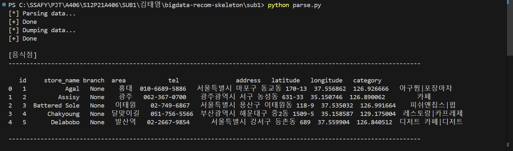
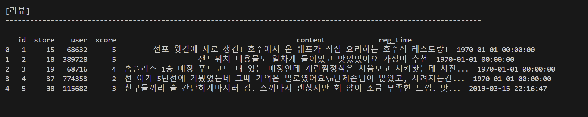
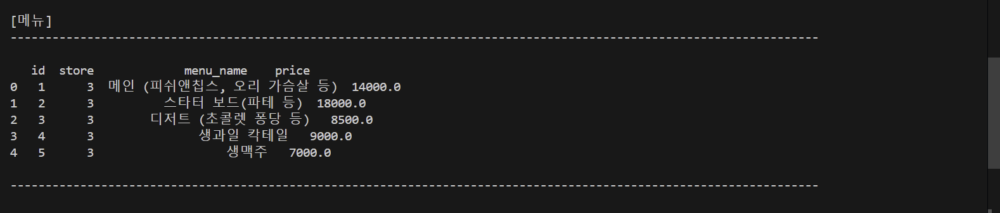
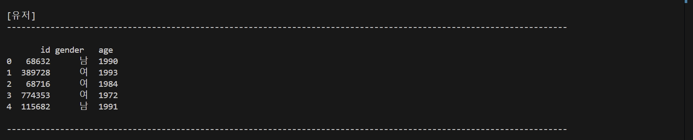
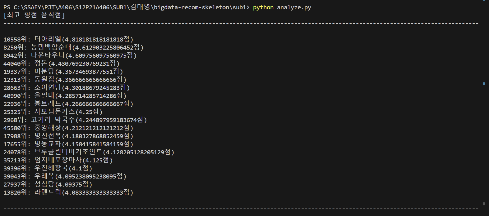
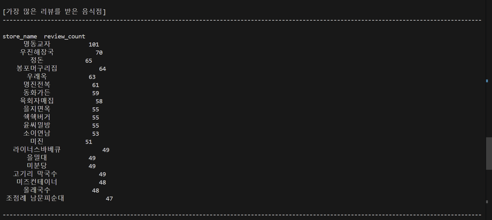
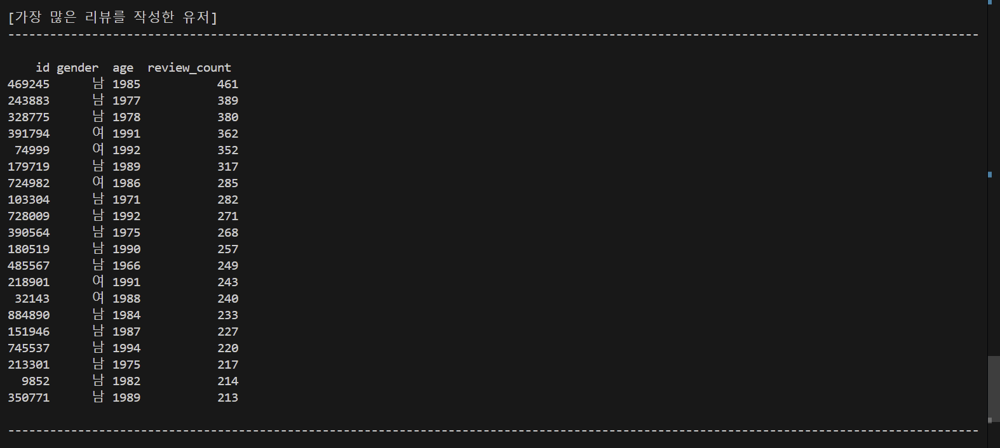

# 2일차 스켈레톤 프로젝트 과제 수행(1)

## Req. 1. 데이터 전처리(parse.py)
- Req. 1-1. 데이터 로딩 및 Pandas DataFrame 변환
    - 전체 데이터를 명세서에서 정의한 스키마의 형태로 파싱되도록 import_data() 함수의 남은 부분 구현
        - 메뉴 컬럼의 id의 경우 제공 데이터에서 id 명시가 없어 1부터 순차적으로 증가하도록 함
        - users의 경우 리뷰 데이터를 처리할 때 동일한 유저가 여러 번 등장할 가능성이 있다고 생각이 되어 딕셔너리({})를 사용하고, 마지막에 list(users.values())로 변환해서 DataFrame으로 저장함

- 구현 완료 parse.py 코드
    ```python
    import json
    import pandas as pd
    import os
    import shutil

    DATA_DIR = "../data"
    DATA_FILE = os.path.join(DATA_DIR, "data.json")
    DUMP_FILE = os.path.join(DATA_DIR, "dump.pkl")

    store_columns = (
        "id",  # 음식점 고유번호
        "store_name",  # 음식점 이름
        "branch",  # 음식점 지점 여부
        "area",  # 음식점 위치
        "tel",  # 음식점 번호
        "address",  # 음식점 주소
        "latitude",  # 음식점 위도
        "longitude",  # 음식점 경도
        "category",  # 음식점 카테고리
    )

    review_columns = (
        "id",  # 리뷰 고유번호
        "store",  # 음식점 고유번호
        "user",  # 유저 고유번호
        "score",  # 평점
        "content",  # 리뷰 내용
        "reg_time",  # 리뷰 등록 시간
    )

    menu_columns = (
        "id",  # 메뉴 고유번호
        "store",  # 음식점 고유번호
        "menu_name",  # 메뉴 이름
        "price",  # 가격
    )

    user_columns = (
        "id",  # 유저 고유번호
        "gender",  # 성별
        "age",  # 나이
    )

    def import_data(data_path=DATA_FILE):
        """
        Req. 1-1-1 음식점 데이터 파일을 읽어서 Pandas DataFrame 형태로 저장합니다
        """

        try:
            with open(data_path, encoding="utf-8") as f:
                data = json.loads(f.read())
        except FileNotFoundError as e:
            print(f"`{data_path}` 가 존재하지 않습니다.")
            exit(1)

        stores = []  # 음식점 테이블
        reviews = []  # 리뷰 테이블
        menus = []  # 메뉴 테이블
        users = {} # 유저 테이블 (중복 방지)

        menu_id = 1  # 메뉴 ID 자동 증가 값
        
        for d in data:

            categories = [c["category"] for c in d.get("category_list", [])]
            stores.append(
                [
                    d["id"],
                    d["name"],
                    d.get("branch", ""),
                    d.get("area", ""),
                    d.get("tel", ""),
                    d.get("address", ""),
                    d.get("latitude"),
                    d.get("longitude"),
                    "|".join(categories),
                ]
            )
            
            for menu in d.get("menu_list", []):
                menus.append(
                    [
                        menu_id,
                        d["id"],
                        menu.get("menu", ""),
                        menu.get("price", 0)
                    ]
                )
                menu_id += 1

            for review in d.get("review_list", []):
                r = review["review_info"]
                u = review["writer_info"]

                reviews.append(
                    [r["id"], d["id"], u["id"], r["score"], r["content"], r["reg_time"]]
                )
                
                users[u["id"]] = [u["id"], u["gender"], u["born_year"]]

        store_frame = pd.DataFrame(data=stores, columns=store_columns)
        review_frame = pd.DataFrame(data=reviews, columns=review_columns)
        menu_frame = pd.DataFrame(data=menus, columns=menu_columns)
        user_frame = pd.DataFrame(data=list(users.values()), columns=user_columns)

        return {"stores": store_frame, "reviews": review_frame, "menus": menu_frame, "users": user_frame}


    def dump_dataframes(dataframes):
        pd.to_pickle(dataframes, DUMP_FILE)


    def load_dataframes():
        return pd.read_pickle(DUMP_FILE)


    def main():

        print("[*] Parsing data...")
        data = import_data()
        print("[+] Done")

        print("[*] Dumping data...")
        dump_dataframes(data)
        print("[+] Done\n")

        data = load_dataframes()

        term_w = shutil.get_terminal_size()[0] - 1
        separater = "-" * term_w

        print("[음식점]")
        print(f"{separater}\n")
        print(data["stores"].head())
        print(f"\n{separater}\n\n")

        print("[리뷰]")
        print(f"{separater}\n")
        print(data["reviews"].head())
        print(f"\n{separater}\n\n")
        
        print("[메뉴]")
        print(f"{separater}\n")
        print(data["menus"].head())
        print(f"\n{separater}\n\n")
        
        print("[유저]")
        print(f"{separater}\n")
        print(data["users"].head())
        print(f"\n{separater}\n\n")


    if __name__ == "__main__":
        main()
    ```

- 구현 완료 후 parse.py 실행 결과 확인
    
    
    
    

## Req. 2. 데이터 통계 값 구하기 (analyze.py)
- Req. 2-1. 음식점 평점순 출력하기
    - sort_stores_by_score() 함수에 평균 평점을 기준으로 전체 음식점을 정렬하여 평점이 높은 음식점의 목록을 구하는 부분 추가

- Req. 2-2. 최소 리뷰 개수 필터링
    - 리뷰 개수가 일정 개수 이하인 음식점은 결과에서 제외하도록 구현

- Req. 2-3. 리뷰 개수 기준 음식점 정렬
    - 리뷰 개수 기준으로 음식점을 정렬하여 많은 리뷰를 받은 음식점 목록 구하기 기능 구현

- Req. 2-4. 리뷰 개수 기준 유저 정렬
    - 리뷰 개수 기준으로 유저를 정렬하여 많은 리뷰를 작성한 유저 목록 구하기 기능 구현

- 구현 완료 analyze.py 코드
    ```python
    from parse import load_dataframes
    import pandas as pd
    import shutil


    def sort_stores_by_score(dataframes, n=20, min_reviews=30):
        """
        Req. 1-2-1 각 음식점의 평균 평점을 계산하여 높은 평점의 음식점 순으로 n개의 음식점을 정렬하여 리턴합니다
        Req. 1-2-2 리뷰 개수가 `min_reviews` 미만인 음식점은 제외합니다.
        """
        stores_reviews = pd.merge(
            dataframes["stores"], dataframes["reviews"], left_on="id", right_on="store"
        )
        scores_group = stores_reviews.groupby(["store", "store_name"])
        scores = scores_group["score"].mean().reset_index()
        review_counts = scores_group.size().reset_index(name="review_count")
        scores = pd.merge(scores, review_counts, on=["store", "store_name"])
        
        # 최소 리뷰 개수 필터링 적용
        scores = scores[scores["review_count"] >= min_reviews]
        
        # 평점 기준 정렬 후 상위 n개 음식점 반환
        scores = scores.sort_values(by=["score", "review_count"], ascending=[False, False])
        return scores.head(n)


    def get_most_reviewed_stores(dataframes, n=20):
        """
        Req. 1-2-3 가장 많은 리뷰를 받은 n개의 음식점을 정렬하여 리턴합니다
        """
        review_counts = dataframes["reviews"].groupby("store").size().reset_index(name="review_count")
        review_counts = pd.merge(review_counts, dataframes["stores"], left_on="store", right_on="id")
        review_counts = review_counts.sort_values(by="review_count", ascending=False)
        return review_counts.head(n)


    def get_most_active_users(dataframes, n=20):
        """
        Req. 1-2-4 가장 많은 리뷰를 작성한 n명의 유저를 정렬하여 리턴합니다.
        """
        user_reviews = dataframes["reviews"].groupby("user").size().reset_index(name="review_count")
        user_reviews = pd.merge(user_reviews, dataframes["users"], left_on="user", right_on="id")
        user_reviews = user_reviews.sort_values(by="review_count", ascending=False)
        return user_reviews.head(n)


    def main():
        data = load_dataframes()

        term_w = shutil.get_terminal_size()[0] - 1
        separater = "-" * term_w

        stores_most_scored = sort_stores_by_score(data)
        stores_most_reviewed = get_most_reviewed_stores(data)
        users_most_active = get_most_active_users(data)

        print("[최고 평점 음식점]")
        print(f"{separater}\n")
        for i, store in stores_most_scored.iterrows():
            print(
                "{rank}위: {store}({score}점)".format(
                    rank=i + 1, store=store.store_name, score=store.score
                )
            )
        print(f"\n{separater}\n\n")

        print("[가장 많은 리뷰를 받은 음식점]")
        print(f"{separater}\n")
        print(stores_most_reviewed[["store_name", "review_count"]].to_string(index=False))
        print(f"\n{separater}\n\n")
        
        print("[가장 많은 리뷰를 작성한 유저]")
        print(f"{separater}\n")
        print(users_most_active[["id", "gender", "age", "review_count"]].to_string(index=False))
        print(f"\n{separater}\n\n")
        

    if __name__ == "__main__":
        main()
    ```

- 구현 완료 후 analyze.py 실행 결과 확인
    
    
    
