# 3일차 스켈레톤 프로젝트 과제 수행(1)

## Req. 3. 데이터 시각화(visualize.py)
- Req. 3-1. 음식점 리뷰 수 분포 구하기
    - Matplotlib 라이브러리를 활용해 전체 음식점의 리뷰 개수 분포를 그래프로 시각화
    - 구현 완료 show_store_review_distribution_graph() 코드
        ```python
        def show_store_review_distribution_graph():
            """
            Req. 1-3-1 전체 음식점의 리뷰 개수 분포를 그래프로 나타냅니다. 
            """
            # 데이터 불러오기
            dataframes = load_dataframes()
            
            # 음식점별 리뷰 개수 계산
            review_counts = dataframes["reviews"].groupby("store").size()
            
            # 그래프 그리기
            plt.figure(figsize=(10, 6))
            sns.histplot(review_counts, bins=50, kde=False, color="#FEE08B", edgecolor="black")
            plt.xlabel("리뷰 개수")
            plt.ylabel("음식점 수")
            plt.title("음식점별 리뷰 개수 분포")
            plt.grid(True)
            
            # 그래프 출력
            plt.show()
        ```
    - 구현 완료 후 visualize.py 실행 결과 확인
        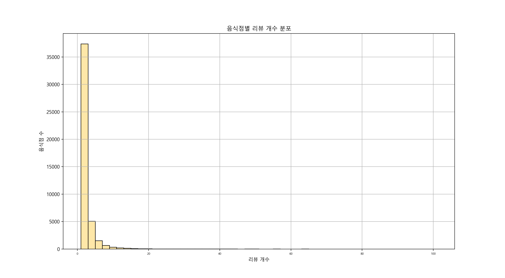


- Req. 3-2. 평균 평점 분포 구하기
    - Matplotlib 라이브러리를 활용해 전체 음식점의 평균 평점 분포를 그래프로 시각화
    - 구현 완료 show_store_average_ratings_graph() 코드
        ```python
        def show_store_average_ratings_graph():
            """
            Req. 1-3-2 각 음식점의 평균 평점을 그래프로 나타냅니다.
            """
            # 데이터 불러오기
            dataframes = load_dataframes()
            
            # 음식점별 평균 평점 계산
            store_ratings = dataframes["reviews"].groupby("store")["total_score"].mean()
            
            # 그래프 그리기
            plt.figure(figsize=(10, 6))
            sns.histplot(store_ratings, bins=30, kde=False, color="#ABDDA4", edgecolor="black", alpha=0.7)
            plt.xlabel("평균 평점")
            plt.ylabel("음식점 수")
            plt.title("음식점별 평균 평점 분포")
            plt.grid(True)
            
            # 그래프 출력
            plt.show()
        ```
    - 구현 완료 후 visualize.py 실행 결과 확인
        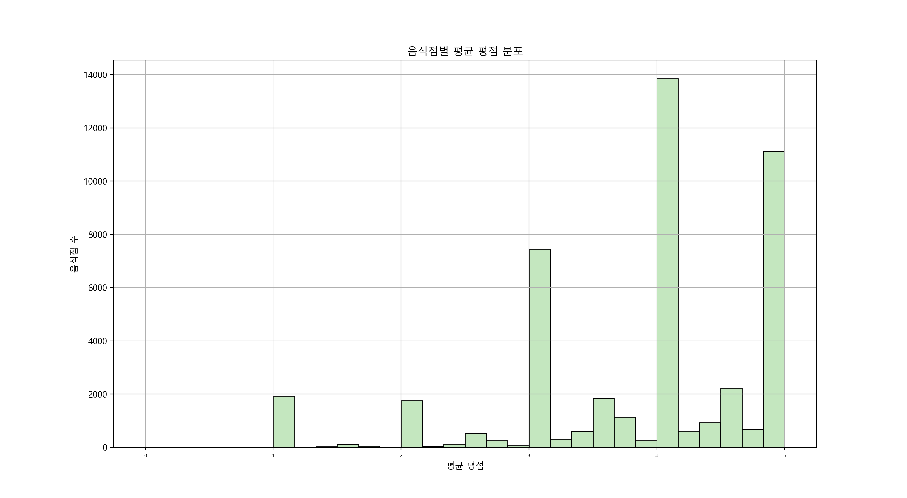


- Req. 3-3. 유저 리뷰 수 분포 구하기
    - Matplotlib 라이브러리를 활용해 전체 유저의 리뷰 개수 분포를 그래프로 시각화
    - 구현 완료 show_user_review_distribution_graph(dataframes) 코드
        ```python
        def show_user_review_distribution_graph(dataframes):
            """
            Req. 1-3-3 전체 유저의 리뷰 개수 분포를 그래프로 나타냅니다.
            """
            # 유저별 리뷰 개수 계산
            user_review_counts = dataframes["reviews"].groupby("user").size()
            
            # 그래프 그리기
            plt.figure(figsize=(10, 6))
            sns.histplot(user_review_counts, bins=50, kde=False, color="#3288BD", edgecolor="black")
            plt.xlabel("리뷰 개수")
            plt.ylabel("유저 수")
            plt.title("유저별 리뷰 개수 분포")
            plt.grid(True)
            
            # 그래프 출력
            plt.show()
        ```
    - 구현 완료 후 visualize.py 실행 결과 확인
        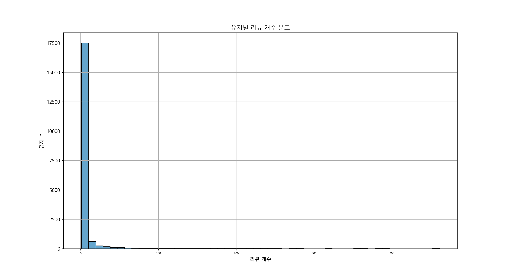


- Req. 3-4. 유저 나이대, 성별 분포 구하기
    - Matplotlib 라이브러리를 활용해 유저의 나이대, 성별 분포를 그래프로 시각화
    - 구현 완료 show_user_age_gender_distribution_graph(dataframes) 코드
        ```python
        def show_user_age_gender_distribution_graph(dataframes):
            """
            Req. 1-3-4 전체 유저의 성별/나이대 분포를 그래프로 나타냅니다.
            """
            user_data = dataframes["users"]
            user_data["age_group"] = (user_data["age"] // 10) * 10  # 연령대를 10년 단위로 분류
            
            plt.figure(figsize=(10, 6))
            sns.histplot(data=user_data, x="age_group", hue="gender", multiple="stack", bins=8, kde=False, color="#66C2A5", edgecolor="black")
            plt.xlabel("나이대")
            plt.ylabel("유저 수")
            plt.title("유저 성별/나이대 분포")
            plt.grid(True)
            plt.show()
        ```
    - 구현 완료 후 visualize.py 실행 결과 확인
        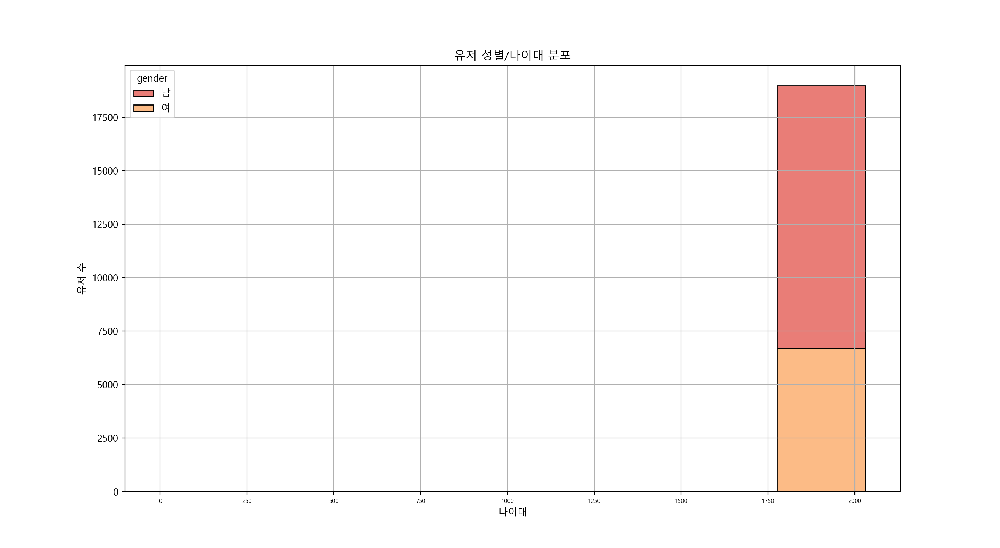


- Req. 3-5. 음식점 위치 분포 구하기
    - Folium 라이브러리를 활용해 음식점들의 위치 분포를 지도에 시각화
    (전체 음식점을 모두 사용할 필요는 없고, 흥미로운 조건(지역, 리뷰 수, 평점)을 주어 일부 음식점만 나타내기 (e.g. 제주도에 있는 카페))
    - 구현 완료 show_stores_distribution_graph(dataframes) 코드
        ```python
        def show_stores_distribution_graph(dataframes):
            """
            Req. 1-3-5 각 음식점의 위치 분포를 지도에 나타냅니다.
            """
            # """
            # - 강남에 있는 음식점만 필터링
            # - 리뷰 수 10개 이상, 평점 4.0점 이상인 음식점만 표시
            # """

            # stores = dataframes["stores"]
            # reviews = dataframes["reviews"]

            # # 강남에 있는 음식점 필터링
            # gangnam_stores = stores[stores["area"].str.contains("강남", na=False)]

            # # 음식점별 평균 평점 및 리뷰 개수 계산
            # review_stats = reviews.groupby("store").agg(
            #     avg_score=("total_score", "mean"), review_count=("id", "count")
            # ).reset_index()

            # # 강남 음식점과 리뷰 통계를 병합
            # gangnam_stores = gangnam_stores.merge(review_stats, left_on="id", right_on="store", how="left")

            # # 평점 4.0 이상 & 리뷰 수 10개 이상인 음식점 필터링
            # selected_stores = gangnam_stores[(gangnam_stores["avg_score"] >= 4.0) & (gangnam_stores["review_count"] >= 10)]

            # # 데이터 확인: 선택된 음식점 개수 출력
            # print(f"선택된 음식점 개수: {len(selected_stores)}")
            # print(selected_stores[["store_name", "latitude", "longitude", "avg_score", "review_count"]].head())

            # # Folium 지도 생성 (강남역 중심 좌표)
            # gangnam_map = folium.Map(location=[37.4979, 127.0276], zoom_start=13)

            # # 마커 추가
            # for _, row in selected_stores.iterrows():
            #     folium.Marker(
            #         location=[row["latitude"], row["longitude"]],
            #         popup=f"{row['store_name']} ({row['avg_score']:.1f}점, 리뷰 {row['review_count']}개)",
            #         icon=folium.Icon(color="blue", icon="info-sign"),
            #     ).add_to(gangnam_map)

            # # 지도 저장 및 자동 실행
            # map_file = "gangnam_stores_map.html"
            # gangnam_map.save(map_file)
            # webbrowser.open(map_file)
            # print(f"강남 음식점 지도 저장 완료: {map_file}")

            """
            강남구 지역을 중심으로 음식점의 밀도와 평균 평점을 시각화
            - 클러스터링 기반 마커 표시
            - 음식점 개수를 구 단위로 집계하여 색상으로 표현
            """
            # 데이터 로드
            stores = dataframes["stores"]
            reviews = dataframes["reviews"]

            # 강남구 음식점 필터링
            gangnam_stores = stores[stores["area"].str.contains("강남", na=False)]

            # 음식점별 평균 평점 및 리뷰 개수 계산
            review_stats = reviews.groupby("store").agg(
                avg_score=("total_score", "mean"), review_count=("id", "count")
            ).reset_index()

            # 강남 음식점과 리뷰 통계를 병합
            gangnam_stores = gangnam_stores.merge(review_stats, left_on="id", right_on="store", how="left")

            # Folium 지도 생성 (강남역 중심 좌표)
            gangnam_map = folium.Map(location=[37.4979, 127.0276], zoom_start=13)

            # 음식점 밀도 클러스터링
            marker_cluster = MarkerCluster().add_to(gangnam_map)

            for _, row in gangnam_stores.iterrows():
                folium.Marker(
                    location=[row["latitude"], row["longitude"]],
                    popup=f"{row['store_name']} ({row['avg_score']:.1f}점, 리뷰 {row['review_count']}개)",
                    icon=folium.Icon(color="blue", icon="info-sign"),
                ).add_to(marker_cluster)

            # 음식점 개수를 구 단위로 집계하여 색상으로 표현
            district_counts = gangnam_stores.groupby("area").size().reset_index(name="store_count")
            min_count, max_count = district_counts["store_count"].min(), district_counts["store_count"].max()

            for _, row in district_counts.iterrows():
                folium.CircleMarker(
                    location=[37.4979, 127.0276],  # 강남구 중심 좌표
                    radius=row["store_count"] / max_count * 20,  # 최대 크기를 20으로 정규화
                    color="red",
                    fill=True,
                    fill_color="red",
                    fill_opacity=0.6,
                    popup=f"{row['area']}: {row['store_count']}개 음식점",
                ).add_to(gangnam_map)

            # 지도 저장 및 자동 실행
            map_file = "gangnam_stores_map2.html"
            gangnam_map.save(map_file)
            webbrowser.open(map_file)
            print(f"강남 음식점 지도 저장 완료: {map_file}")
        ```
    - 구현 완료 후 visualize.py 실행 결과 확인
        - 강남에 있는 음식점 필터링 및 시각화 (리뷰 수 10개 이상, 평점 4.0점 이상인 음식점만 표시)
            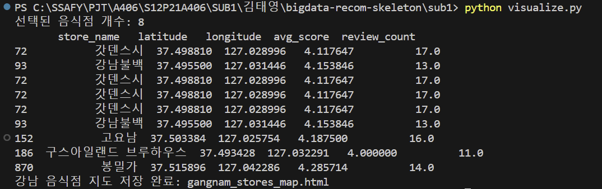
            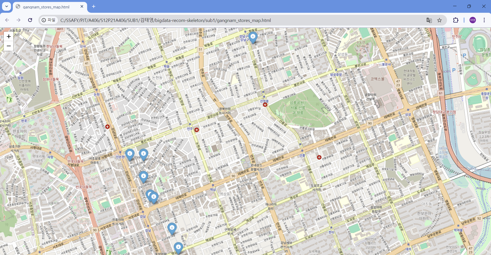
            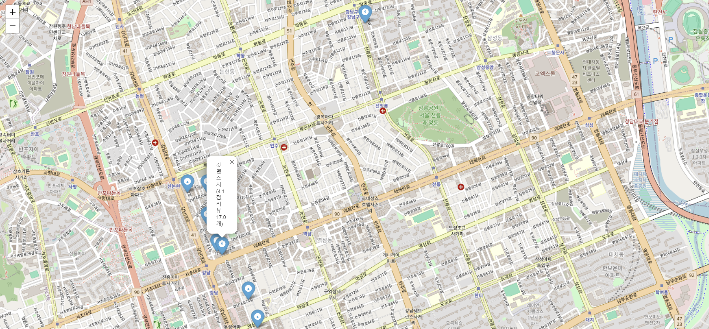
        - 강남구 지역을 중심으로 음식점의 밀도와 평균 평점을 시각화 (클러스터링 기반 마커 표시, 음식점 개수를 구 단위로 집계하여 색상으로 표현)
            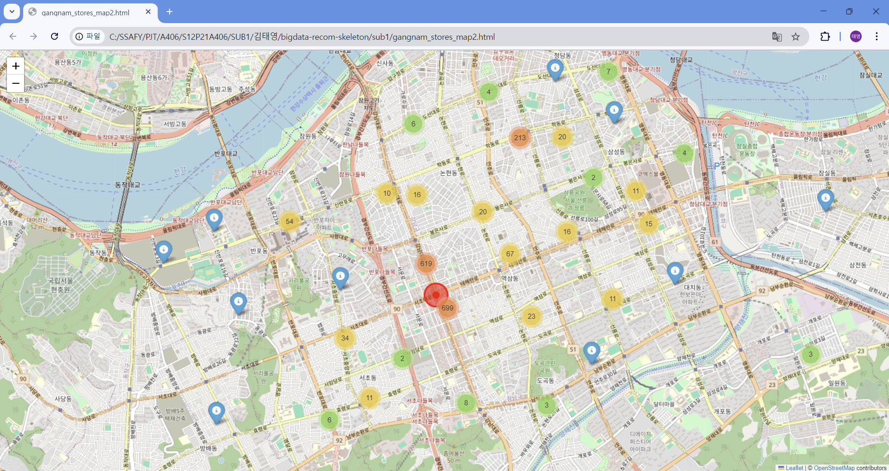
            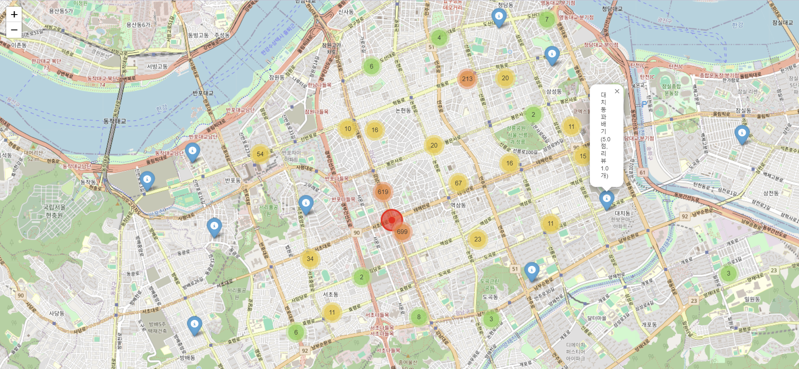
            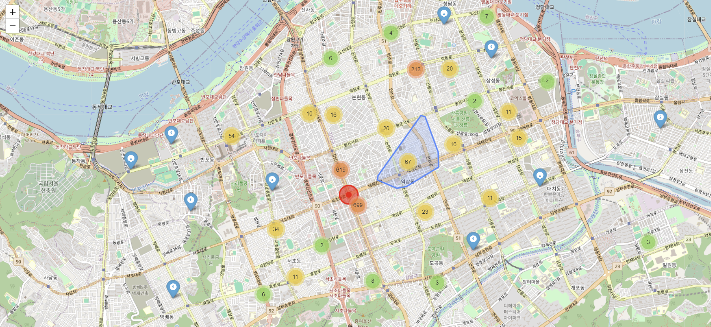
            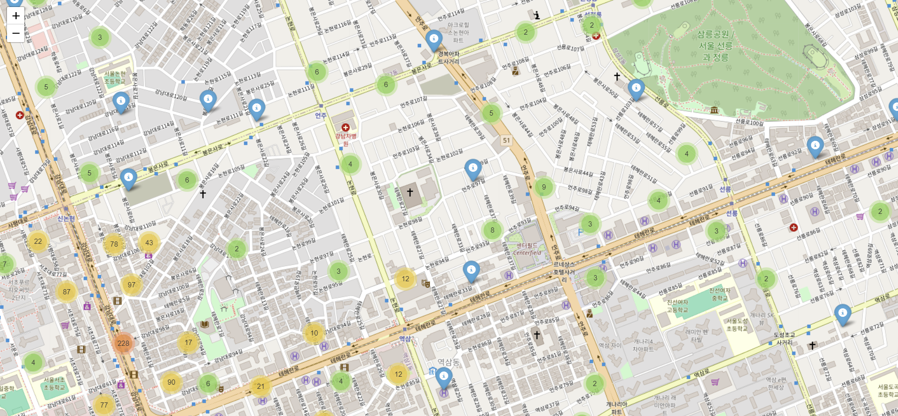


- 구현 완료 visualize.py 코드
    ```python
    import itertools
    import folium
    import webbrowser
    from collections import Counter
    from parse import load_dataframes
    import pandas as pd
    import seaborn as sns
    import matplotlib.pyplot as plt
    import matplotlib.font_manager as fm
    from folium.plugins import MarkerCluster

    def set_config():
        # 폰트, 그래프 색상 설정
        font_list = fm.findSystemFonts(fontpaths=None, fontext="ttf")
        if any(["notosanscjk" in font.lower() for font in font_list]):
            plt.rcParams["font.family"] = "Noto Sans CJK JP"
        else:
            if not any(["malgun" in font.lower() for font in font_list]):
                raise Exception(
                    "Font missing, please install Noto Sans CJK or Malgun Gothic. If you're using ubuntu, try `sudo apt install fonts-noto-cjk`"
                )

            plt.rcParams["font.family"] = "Malgun Gothic"

        sns.set_palette(sns.color_palette("Spectral"))
        plt.rc("xtick", labelsize=6)


    def show_store_categories_graph(dataframes, n=100):
        """
        Tutorial: 전체 음식점의 상위 `n`개 카테고리 분포를 그래프로 나타냅니다.
        """

        stores = dataframes["stores"]

        # 모든 카테고리를 1차원 리스트에 저장합니다
        categories = stores.category.apply(lambda c: c.split("|"))
        categories = itertools.chain.from_iterable(categories)

        # 카테고리가 없는 경우 / 상위 카테고리를 추출합니다
        categories = filter(lambda c: c != "", categories)
        categories_count = Counter(list(categories))
        best_categories = categories_count.most_common(n=n)
        df = pd.DataFrame(best_categories, columns=["category", "count"]).sort_values(
            by=["count"], ascending=False
        )

        # 그래프로 나타냅니다
        chart = sns.barplot(x="category", y="count", data=df)
        chart.set_xticklabels(chart.get_xticklabels(), rotation=45)
        plt.title("음식점 카테고리 분포")
        plt.show()


    def show_store_review_distribution_graph():
        """
        Req. 1-3-1 전체 음식점의 리뷰 개수 분포를 그래프로 나타냅니다. 
        """
        # 데이터 불러오기
        dataframes = load_dataframes()
        
        # 음식점별 리뷰 개수 계산
        review_counts = dataframes["reviews"].groupby("store").size()
        
        # 그래프 그리기
        plt.figure(figsize=(10, 6))
        sns.histplot(review_counts, bins=50, kde=False, color="#FEE08B", edgecolor="black")
        plt.xlabel("리뷰 개수")
        plt.ylabel("음식점 수")
        plt.title("음식점별 리뷰 개수 분포")
        plt.grid(True)
        
        # 그래프 출력
        plt.show()


    def show_store_average_ratings_graph():
        """
        Req. 1-3-2 각 음식점의 평균 평점을 그래프로 나타냅니다.
        """
        # 데이터 불러오기
        dataframes = load_dataframes()
        
        # 음식점별 평균 평점 계산
        store_ratings = dataframes["reviews"].groupby("store")["total_score"].mean()
        
        # 그래프 그리기
        plt.figure(figsize=(10, 6))
        sns.histplot(store_ratings, bins=30, kde=False, color="#ABDDA4", edgecolor="black", alpha=0.7)
        plt.xlabel("평균 평점")
        plt.ylabel("음식점 수")
        plt.title("음식점별 평균 평점 분포")
        plt.grid(True)
        
        # 그래프 출력
        plt.show()


    def show_user_review_distribution_graph(dataframes):
        """
        Req. 1-3-3 전체 유저의 리뷰 개수 분포를 그래프로 나타냅니다.
        """
        # 유저별 리뷰 개수 계산
        user_review_counts = dataframes["reviews"].groupby("user").size()
        
        # 그래프 그리기
        plt.figure(figsize=(10, 6))
        sns.histplot(user_review_counts, bins=50, kde=False, color="#3288BD", edgecolor="black")
        plt.xlabel("리뷰 개수")
        plt.ylabel("유저 수")
        plt.title("유저별 리뷰 개수 분포")
        plt.grid(True)
        
        # 그래프 출력
        plt.show()


    def show_user_age_gender_distribution_graph(dataframes):
        """
        Req. 1-3-4 전체 유저의 성별/나이대 분포를 그래프로 나타냅니다.
        """
        user_data = dataframes["users"]
        user_data["age_group"] = (user_data["age"] // 10) * 10  # 연령대를 10년 단위로 분류
        
        plt.figure(figsize=(10, 6))
        sns.histplot(data=user_data, x="age_group", hue="gender", multiple="stack", bins=8, kde=False, color="#66C2A5", edgecolor="black")
        plt.xlabel("나이대")
        plt.ylabel("유저 수")
        plt.title("유저 성별/나이대 분포")
        plt.grid(True)
        plt.show()


    def show_stores_distribution_graph(dataframes):
        """
        Req. 1-3-5 각 음식점의 위치 분포를 지도에 나타냅니다.
        """
        # """
        # - 강남에 있는 음식점만 필터링
        # - 리뷰 수 10개 이상, 평점 4.0점 이상인 음식점만 표시
        # """

        # stores = dataframes["stores"]
        # reviews = dataframes["reviews"]

        # # 강남에 있는 음식점 필터링
        # gangnam_stores = stores[stores["area"].str.contains("강남", na=False)]

        # # 음식점별 평균 평점 및 리뷰 개수 계산
        # review_stats = reviews.groupby("store").agg(
        #     avg_score=("total_score", "mean"), review_count=("id", "count")
        # ).reset_index()

        # # 강남 음식점과 리뷰 통계를 병합
        # gangnam_stores = gangnam_stores.merge(review_stats, left_on="id", right_on="store", how="left")

        # # 평점 4.0 이상 & 리뷰 수 10개 이상인 음식점 필터링
        # selected_stores = gangnam_stores[(gangnam_stores["avg_score"] >= 4.0) & (gangnam_stores["review_count"] >= 10)]

        # # 데이터 확인: 선택된 음식점 개수 출력
        # print(f"선택된 음식점 개수: {len(selected_stores)}")
        # print(selected_stores[["store_name", "latitude", "longitude", "avg_score", "review_count"]].head())

        # # Folium 지도 생성 (강남역 중심 좌표)
        # gangnam_map = folium.Map(location=[37.4979, 127.0276], zoom_start=13)

        # # 마커 추가
        # for _, row in selected_stores.iterrows():
        #     folium.Marker(
        #         location=[row["latitude"], row["longitude"]],
        #         popup=f"{row['store_name']} ({row['avg_score']:.1f}점, 리뷰 {row['review_count']}개)",
        #         icon=folium.Icon(color="blue", icon="info-sign"),
        #     ).add_to(gangnam_map)

        # # 지도 저장 및 자동 실행
        # map_file = "gangnam_stores_map.html"
        # gangnam_map.save(map_file)
        # webbrowser.open(map_file)
        # print(f"강남 음식점 지도 저장 완료: {map_file}")

        """
        강남구 지역을 중심으로 음식점의 밀도와 평균 평점을 시각화
        - 클러스터링 기반 마커 표시
        - 음식점 개수를 구 단위로 집계하여 색상으로 표현
        """
        # 데이터 로드
        stores = dataframes["stores"]
        reviews = dataframes["reviews"]

        # 강남구 음식점 필터링
        gangnam_stores = stores[stores["area"].str.contains("강남", na=False)]

        # 음식점별 평균 평점 및 리뷰 개수 계산
        review_stats = reviews.groupby("store").agg(
            avg_score=("total_score", "mean"), review_count=("id", "count")
        ).reset_index()

        # 강남 음식점과 리뷰 통계를 병합
        gangnam_stores = gangnam_stores.merge(review_stats, left_on="id", right_on="store", how="left")

        # Folium 지도 생성 (강남역 중심 좌표)
        gangnam_map = folium.Map(location=[37.4979, 127.0276], zoom_start=13)

        # 음식점 밀도 클러스터링
        marker_cluster = MarkerCluster().add_to(gangnam_map)

        for _, row in gangnam_stores.iterrows():
            folium.Marker(
                location=[row["latitude"], row["longitude"]],
                popup=f"{row['store_name']} ({row['avg_score']:.1f}점, 리뷰 {row['review_count']}개)",
                icon=folium.Icon(color="blue", icon="info-sign"),
            ).add_to(marker_cluster)

        # 음식점 개수를 구 단위로 집계하여 색상으로 표현
        district_counts = gangnam_stores.groupby("area").size().reset_index(name="store_count")
        min_count, max_count = district_counts["store_count"].min(), district_counts["store_count"].max()

        for _, row in district_counts.iterrows():
            folium.CircleMarker(
                location=[37.4979, 127.0276],  # 강남구 중심 좌표
                radius=row["store_count"] / max_count * 20,  # 최대 크기를 20으로 정규화
                color="red",
                fill=True,
                fill_color="red",
                fill_opacity=0.6,
                popup=f"{row['area']}: {row['store_count']}개 음식점",
            ).add_to(gangnam_map)

        # 지도 저장 및 자동 실행
        map_file = "gangnam_stores_map2.html"
        gangnam_map.save(map_file)
        webbrowser.open(map_file)
        print(f"강남 음식점 지도 저장 완료: {map_file}")


    def main():
        set_config()
        data = load_dataframes()
        show_store_categories_graph(data) # 음식점 카테고리 분포
        show_store_review_distribution_graph() # 음식점별 리뷰 개수 분포
        show_store_average_ratings_graph() # 음식점별 평균 평점 분포
        show_user_review_distribution_graph(data) # 유저별 리뷰 개수 분포
        show_user_age_gender_distribution_graph(data) # 유저 성별/나이대 분포
        show_stores_distribution_graph(data) # 각 음식점의 위치 분포를 지도에 나타내기 - 강남구 지역을 중심으로 음식점의 밀도와 평균 평점을 시각화


    if __name__ == "__main__":
        main()
        
    ```
- 사전에 제공된 튜토리얼(전체 음식점의 상위 n개 카테고리 분포를 그래프로 시각화) 실행 결과 확인
    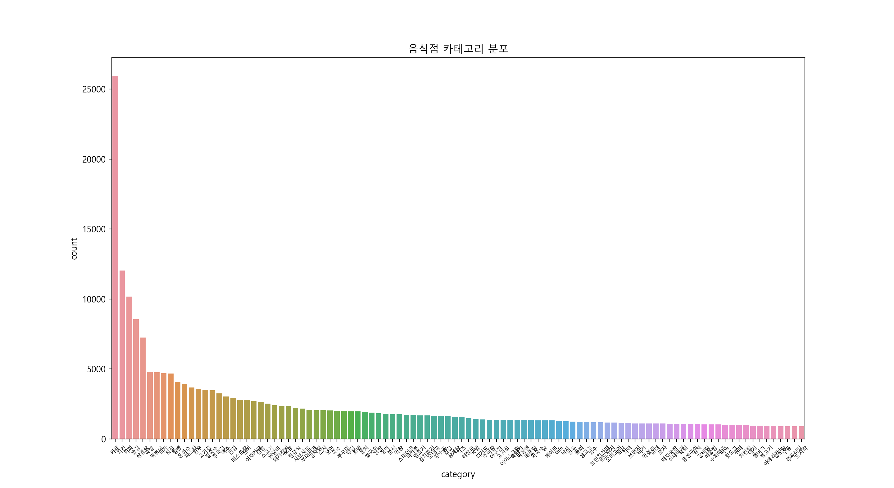


## Req. 4. 유저-아이템 행렬 생성
- Req. 4-1. 유저-음식점 행렬 생성
    - 유저와 음식점을 축으로 하고 평점을 값으로 갖는 행렬을 만들어 저장
    (이때 Pandas Sparse 행렬 데이터 타입으로 저장해 메모리 효율을 높여야 함)
    - 구현 완료 generate_user_store_matrix.py 코드
        ```python
        import os
        import pandas as pd
        from parse import load_dataframes

        # 저장할 폴더 경로 설정
        DATA_DIR = "../data"
        PKL_FILE = os.path.join(DATA_DIR, "sparse_rating_matrix.pkl")

        def generate_user_store_matrix(dataframes):
            """
            유저 - 음식점 평점 행렬을 생성하여 SparseDataFrame으로 변환 후 저장 (data 폴더 안에 저장)
            """
            # 리뷰 데이터 로드
            reviews = dataframes["reviews"]

            # 평점 데이터를 행렬 형태로 변환 (pivot)
            rating_matrix = reviews.pivot(index="user", columns="store", values="total_score")

            # Pandas Sparse Matrix 변환 (메모리 절약)
            # NaN을 0으로 변환 후 Sparse Matrix 변환
            sparse_matrix = rating_matrix.fillna(0).astype(pd.SparseDtype("float", fill_value=0))

            # data 폴더가 없으면 생성
            os.makedirs(DATA_DIR, exist_ok=True)

            # Sparse 행렬 저장
            sparse_matrix.to_pickle(PKL_FILE)
            print(f"유저-음식점 평점 희소 행렬 저장 완료: {PKL_FILE}")

            return sparse_matrix  # 생성된 행렬 반환

        def load_and_display_matrix():
            """
            저장된 유저-음식점 희소 행렬을 불러와서 확인
            """
            if os.path.exists(PKL_FILE):
                sparse_matrix = pd.read_pickle(PKL_FILE)
                print("유저-음식점 평점 희소 행렬 로드 완료")
                print(f"행렬 크기: {sparse_matrix.shape}")  # (유저 수, 음식점 수)
                print(sparse_matrix.head())  # 상위 5개 행 출력
            else:
                print(f"파일이 존재하지 않습니다: {PKL_FILE}")

        def main():
            data = load_dataframes()
            sparse_matrix = generate_user_store_matrix(data)
            load_and_display_matrix()  # 저장 후 바로 확인

        if __name__ == "__main__":
            main()
        ```
    - 구현 완료 후 실행 결과 확인
        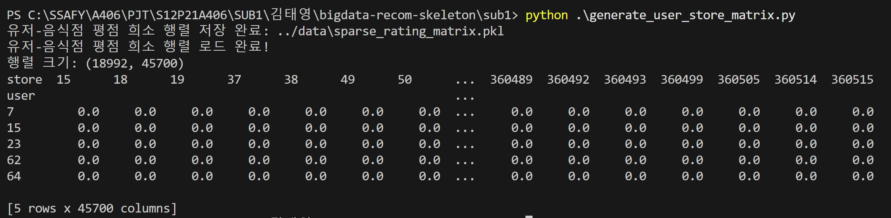


- Req. 4-2. 유저-카테고리 행렬 생성
    - 유저와 음식점 카테고리를 축으로 하고 평점 평균을 값으로 갖는 행렬을 만들어 저장
    (이때 Pandas Sparse 행렬 데이터 타입으로 저장해 메모리 효율을 높여야 함)
    - 구현 완료 generate_user_category_matrix.py 코드
        ```python
        import os
        import pandas as pd
        from parse import load_dataframes

        # 저장할 폴더 경로 설정
        DATA_DIR = "../data"
        PKL_FILE = os.path.join(DATA_DIR, "sparse_user_category_matrix.pkl")

        def generate_user_category_matrix(dataframes):
            """
            유저 - 음식점 카테고리 평점 행렬을 생성하여 SparseDataFrame으로 변환 후 저장 (data 폴더 안에 저장)
            """
            # 음식점 및 리뷰 데이터 로드
            stores = dataframes["stores"]
            reviews = dataframes["reviews"]

            # 음식점 ID와 카테고리 매핑
            store_categories = stores[["id", "category"]].copy()

            # 여러 개의 카테고리를 가지는 경우 첫 번째 카테고리만 선택
            store_categories["category"] = store_categories["category"].apply(lambda x: x.split("|")[0] if "|" in x else x)

            # 리뷰 데이터와 음식점 카테고리 결합
            reviews_with_category = reviews.merge(store_categories, left_on="store", right_on="id", how="left")

            # 유저-카테고리 별 평균 평점 계산
            category_rating_matrix = reviews_with_category.groupby(["user", "category"])["total_score"].mean().reset_index()

            # 평점 데이터를 행렬 형태로 변환 (pivot)
            rating_matrix = category_rating_matrix.pivot(index="user", columns="category", values="total_score")

            # Pandas Sparse Matrix 변환 (메모리 절약)
            sparse_matrix = rating_matrix.fillna(0).astype(pd.SparseDtype("float", fill_value=0))

            # data 폴더가 없으면 생성
            os.makedirs(DATA_DIR, exist_ok=True)

            # Sparse 행렬 저장
            sparse_matrix.to_pickle(PKL_FILE)
            print(f"유저-음식점 카테고리 평점 희소 행렬 저장 완료: {PKL_FILE}")

            return sparse_matrix  # 생성된 행렬 반환

        def load_and_display_matrix():
            """
            저장된 유저-음식점 카테고리 희소 행렬을 불러와서 확인
            """
            if os.path.exists(PKL_FILE):
                sparse_matrix = pd.read_pickle(PKL_FILE)
                print("유저-음식점 카테고리 평점 희소 행렬 로드 완료")
                print(f"행렬 크기: {sparse_matrix.shape}")  # (유저 수, 카테고리 수)
                print(sparse_matrix.head())  # 상위 5개 행 출력
            else:
                print(f"파일이 존재하지 않습니다: {PKL_FILE}")

        def main():
            data = load_dataframes()
            sparse_matrix = generate_user_category_matrix(data)
            load_and_display_matrix()  # 저장 후 바로 확인

        if __name__ == "__main__":
            main()
        
        ```
    - 구현 완료 user_clustering.py 코드
        ```python
        import os
        import pandas as pd
        import numpy as np
        import matplotlib.font_manager as fm
        from sklearn.decomposition import PCA
        from sklearn.cluster import KMeans
        from sklearn.preprocessing import StandardScaler
        from sklearn.utils import parallel_backend
        import matplotlib.pyplot as plt
        import seaborn as sns

        # 환경 변수 설정 (멀티코어 오류 방지)
        os.environ["LOKY_MAX_CPU_COUNT"] = "4"

        # 데이터 파일 경로 설정
        DATA_DIR = "../data"
        PKL_FILE = os.path.join(DATA_DIR, "sparse_user_category_matrix.pkl")

        def set_config():
            # 폰트, 그래프 색상 설정
            font_list = fm.findSystemFonts(fontpaths=None, fontext="ttf")
            if any(["notosanscjk" in font.lower() for font in font_list]):
                plt.rcParams["font.family"] = "Noto Sans CJK JP"
            else:
                if not any(["malgun" in font.lower() for font in font_list]):
                    raise Exception(
                        "Font missing, please install Noto Sans CJK or Malgun Gothic. If you're using ubuntu, try `sudo apt install fonts-noto-cjk`"
                    )

                plt.rcParams["font.family"] = "Malgun Gothic"

            sns.set_palette(sns.color_palette("Spectral"))
            plt.rc("xtick", labelsize=6)

        def load_sparse_matrix():
            """ 저장된 유저-음식점 카테고리 희소 행렬을 불러옴 """
            if os.path.exists(PKL_FILE):
                sparse_matrix = pd.read_pickle(PKL_FILE)
                print("유저-음식점 카테고리 평점 희소 행렬 로드 완료")
                print(f"행렬 크기: {sparse_matrix.shape}")  # (유저 수, 카테고리 수)
                return sparse_matrix
            else:
                print(f"파일이 존재하지 않습니다: {PKL_FILE}")
                return None

        def preprocess_matrix(sparse_matrix):
            """ 희소 행렬을 밀집 행렬(Dense)로 변환하고 정규화 """
            dense_matrix = sparse_matrix.sparse.to_dense()
            scaler = StandardScaler()
            scaled_matrix = scaler.fit_transform(dense_matrix)
            return scaled_matrix

        def apply_pca(scaled_matrix, n_components=50):
            """ 차원 축소(PCA)를 수행하여 군집화를 용이하게 함 """
            pca = PCA(n_components=n_components)
            reduced_matrix = pca.fit_transform(scaled_matrix)
            
            explained_variance = np.sum(pca.explained_variance_ratio_) * 100
            print(f"PCA 적용 완료! {n_components}개 차원으로 축소됨 (설명된 분산: {explained_variance:.2f}%)")
            return reduced_matrix

        def perform_kmeans_clustering(reduced_matrix, n_clusters=10):
            """ K-Means 군집화 수행 (멀티코어 오류 방지) """
            kmeans = KMeans(n_clusters=n_clusters, random_state=42, n_init=10)

            with parallel_backend("threading", n_jobs=1):  # 멀티코어 사용 제한
                cluster_labels = kmeans.fit_predict(reduced_matrix)

            print("K-Means 군집화 완료")
            return cluster_labels, kmeans

        def visualize_clusters(reduced_matrix, cluster_labels):
            """ 군집화 결과를 2D 시각화 (PCA 주성분 기준) """
            plt.figure(figsize=(8, 6))
            sns.scatterplot(x=reduced_matrix[:, 0], y=reduced_matrix[:, 1], hue=cluster_labels, palette="tab10", alpha=0.7)
            plt.xlabel("PCA Component 1")
            plt.ylabel("PCA Component 2")
            plt.title("유저 군집화 결과 (K-Means)")
            plt.legend(title="Cluster")
            plt.show()

        def analyze_clusters(sparse_matrix, cluster_labels):
            """ 군집별 유저 수 및 대표적인 음식점 카테고리 분석 """
            sparse_matrix["Cluster"] = cluster_labels
            cluster_counts = sparse_matrix["Cluster"].value_counts().sort_index()
            print("\n군집별 유저 수:")
            print(cluster_counts)

            print("\n군집별 대표 음식점 카테고리 (평균 평점 상위 3개):")
            for cluster in range(len(cluster_counts)):
                cluster_data = sparse_matrix[sparse_matrix["Cluster"] == cluster].drop(columns=["Cluster"])
                
                category_means = cluster_data.mean()
                category_means = category_means[category_means > 0].sort_values(ascending=False).head(3)
                
                print(f"\n[Cluster {cluster}]")
                print(category_means)

        def main():
            set_config()
            sparse_matrix = load_sparse_matrix()
            if sparse_matrix is not None:
                scaled_matrix = preprocess_matrix(sparse_matrix)
                reduced_matrix = apply_pca(scaled_matrix, n_components=50)
                cluster_labels, kmeans = perform_kmeans_clustering(reduced_matrix, n_clusters=10)

                # 군집화된 결과를 시각화
                visualize_clusters(reduced_matrix, cluster_labels)

                # 군집 분석 (유저 수 및 대표 카테고리)
                analyze_clusters(sparse_matrix, cluster_labels)

        if __name__ == "__main__":
            main()
        ```
    - 구현 완료 후 실행 결과 확인
        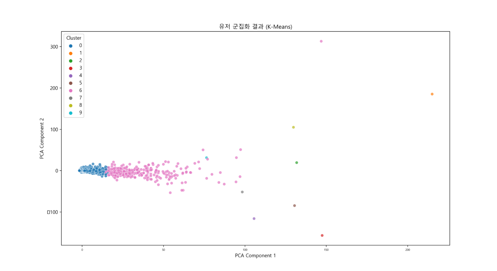
