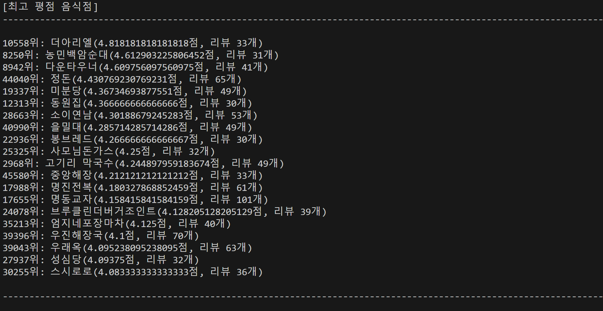
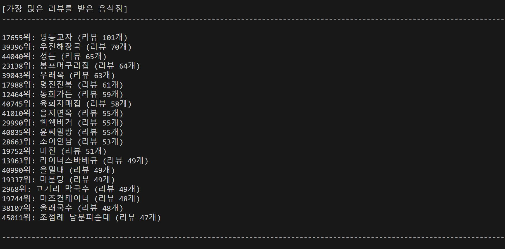
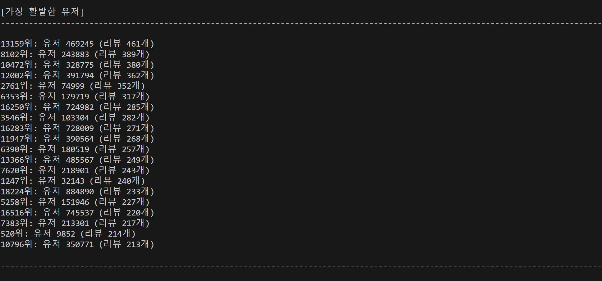

# 250305 DAY2 개인 과제 및 실습

## 명세서 과제 실습 - Rep 2. 데이터 통계 값 구하기(analyze.py) 

- import_data() 함수의 남은 부분 구현하여 전체 데이터를 앞서 정의한 스키마의 형태로 파싱하기

```
from parse import load_dataframes
import pandas as pd
import shutil


def sort_stores_by_score(dataframes, n=20, min_reviews=30):
    """
    Req. 1-2-1 각 음식점의 평균 평점을 계산하여 높은 평점의 음식점 순으로 `n`개의 음식점을 정렬하여 리턴합니다
    Req. 1-2-2 리뷰 개수가 `min_reviews` 미만인 음식점은 제외합니다.
    """
    stores_reviews = pd.merge(
        dataframes["stores"], dataframes["reviews"], left_on="id", right_on="store"
    )
    scores_group = stores_reviews.groupby(["store", "store_name"])
    scores = scores_group["score"].mean().reset_index(name="avg_score")
    review_counts = scores_group["score"].count().reset_index(name="review_count")

    # 리뷰 개수가 min_reviews 이상인 음식점 필터링
    filtered_scores = pd.merge(scores, review_counts, on=["store", "store_name"])
    filtered_scores = filtered_scores[filtered_scores.review_count >= min_reviews]

    # 평균 평점이 높은 순으로 정렬 후 상위 n개 반환
    return filtered_scores.sort_values(by="avg_score", ascending=False).head(n)

def get_most_reviewed_stores(dataframes, n=20):
    """
    Req. 1-2-3 가장 많은 리뷰를 받은 `n`개의 음식점을 정렬하여 리턴합니다
    """
    stores_reviews = pd.merge(
        dataframes["stores"], dataframes["reviews"], left_on="id", right_on="store"
    )
    review_counts = stores_reviews.groupby(["store", "store_name"]).size().reset_index(name="review_count")

    return review_counts.sort_values(by="review_count", ascending=False).head(n)


def get_most_active_users(dataframes, n=20):
    """
    Req. 1-2-4 가장 많은 리뷰를 작성한 `n`명의 유저를 정렬하여 리턴합니다.
    """
    user_review_counts = dataframes["reviews"].groupby("user").size().reset_index(name="review_count")

    return user_review_counts.sort_values(by="review_count", ascending=False).head(n)


def main():
    data = load_dataframes()

    term_w = shutil.get_terminal_size()[0] - 1
    separater = "-" * term_w

    stores_most_scored = sort_stores_by_score(data)
    most_reviewed_stores = get_most_reviewed_stores(data)
    most_active_users = get_most_active_users(data)


    print("[최고 평점 음식점]")
    print(f"{separater}\n")
    for i, store in stores_most_scored.iterrows():
        print(
            "{rank}위: {store}({score}점, 리뷰 {count}개)".format(
                rank=i + 1, store=store.store_name, score=store.avg_score, count=store.review_count
            )
        )
    print(f"\n{separater}\n\n")

    print("[가장 많은 리뷰를 받은 음식점]")
    print(f"{separater}\n")
    for i, store in most_reviewed_stores.iterrows():
        print(
            "{rank}위: {store} (리뷰 {count}개)".format(
                rank=i + 1, store=store.store_name, count=store.review_count
            )
        )
    print(f"\n{separater}\n\n")

    print("[가장 활발한 유저]")
    print(f"{separater}\n")
    for i, user in most_active_users.iterrows():
        print(
            "{rank}위: 유저 {user_id} (리뷰 {count}개)".format(
                rank=i + 1, user_id=user.user, count=user.review_count
            )
        )
    print(f"\n{separater}\n\n")


if __name__ == "__main__":
    main()

```





## 기획 - 아이디어 도출

### 부동산

- **서비스명** : **교집합 🏠🪴**
- **서비스 간단 소개**
  : 내가 설정한 조건들의 교집합을 찾아 매물을 추천해 주는 부동산 서비스
- **기획 배경**
  - 사용자가 적합한 매물을 찾기 위해 여러 사이트를 탐색해야 하는 불편함 해소
  - 하나의 목표 지역만 잡고 매물을 탐색하는 불편함 해소
  - 기존 부동산 플랫폼은 단순 필터링에 의존하며, 개인의 생활 패턴이나 선호도를 반영하지 못함
- **페르소나 설정**
  - **타겟 사용자 1 : 곧 결혼하는 예비 신부 김싸피 (32)**
  - Pain Point
    - 예비 신랑의 직장과 예비 신부의 직장 사이의 거리가 멀다.
    - 두 직장 사이 거리와 교통편을 고려한 매물을 찾고 싶어함
  - **타겟 사용자 2 : 대학교에 입학을 위한 자취를 하게 된 정싸피 (20)**
  - Pain Point
    - 대학교에서 대중교통으로 30분까진 괜찮지만 그 이상의 지역으론 벗어나고 싶지 않음
    - 강아지를 키우고 있어, 24시 동물 병원과 공원이 도보 10분 이내에 있는 매물을 원함
- **기획 목표**
  - 사용자가 고려하는 여러 조건을 한 번에 반영한 매물 추천으로 편의성, 접근성을 높임
- **어떤 서비스를 제공할 것인지(주요 서비스(추천 서비스도 있으면 같이 기입))**
  - 필수 조건 3가지를 설정할 수 있음 → 해당 조건 3가지를 반영한 매물 추천
  - 선택한 매물과 직장 혹은 학교로 가는 최적의 대중교통 경로 제공
- **구현에 있어 어떤 기술, 혹은 데이터가 사용이 되는가? 사용 이유도 함께 기입**
  - 선택한 조건에서 거리를 계산할 수 있는 알고리즘
  - 대중교통 경로를 반환할 수 있는 API 혹은 데이터
  - 조건(동물병원, 공원 등)의 주변 시설을 반환할 수 있는 API 혹은 데이터
- **이 서비스는 어떤 문제를 해결하는가? (기대효과)**
  - 지역 위주로 필터링하던 기존 서비스에서 더 나아가 사용자의 필수 조건, 고려 조건을 충족하는 매물을 필터링하여 보여줄 수 있음 → 여러 매물과 조건을 비교하며 찾아야 했던 기존의 번거로움을 해결할 수 있다
- **기존 서비스 대비 차별점은 무엇인가?**
  - 사용자가 설정하는 여러 조건을 결합한 매물 추천

---

### 새 아이디어

- **서비스명** : **반짝 (반려동물 + 짝) ✨**
- **서비스 간단 소개**
  : 나의 반려동물 생애주기 전반을 관리할 수 있는 서비스, 반려동물의 마지막 순간까지 함께하는 서비스를 목표로! 🥹⭐
- **기획 배경**
  - 펫코노미 2.0 시대 - 반려동물 시장이 단순 용품 소비에서 건강·웰니스·보험·장례 등 라이프사이클 전반으로 확장됨.
  - 반려동물의 노령화 - 반려동물의 기대수명이 길어지면서 건강 관리 및 의료 서비스에 대한 필요성이 증가.
  - 인구 구조적 변화
    - 딩펫족(딩크+펫), 혼펫족(혼자 사는 반려인) 증가로 반려동물 케어에 대한 관심이 높아짐.
    - 반려동물을 가족처럼 여기는 펫팸족 증가로 체계적인 관리 수요 상승.
  - 데이터 기반 맞춤 케어 필요
    - 현재 반려동물 건강관리는 개별적인 경험과 감에 의존하는 경우가 많음.
    - AI 및 데이터 분석을 활용하여 맞춤형 건강관리·추천·조기진단 서비스 제공 가능.
- **페르소나 설정**
  - **타겟 사용자 1 : 노령 반려동물을 키우고 있는 김싸피의 가족**
  - Pain Point
    - 반려동물의 건강 데이터를 축적하고, 적절한 의료 서비스 연계를 원함
    - 노견임을 인식하고, 이에 따라 미래를 준비하고 있음
  - **타겟 사용자 2 : 강아지를 입양한 직장인 박싸피 (31세)**
  - Pain Point
    - 반려동물 건강 관리 및 이상징후 파악이 어려움
    - 직장 등으로 인해 반려동물 케어에 많은 시간을 투자하기 어려
- **기획 목표**
  - 반려동물 생애주기 전반을 기록하고 건강을 체계적으로 관리할 수 있는 서비스 제공
  - AI 기반 데이터 분석을 활용한 맞춤형 건강 관리 및 조기 이상 감지 시스템 구축
  - 단순 기록이 아닌 병원 및 장례식장 연계 등 반려동물의 마지막까지 함께할 수 있는 기능 포함
- **어떤 서비스를 제공할 것인지(주요 서비스(추천 서비스도 있으면 같이 기입))**
  1. **내 반려동물 프로필 관리**
     - 반려동물 기본 정보 등록 (이름, 종, 생년월일, 몸무게 등)
     - 성장 데이터 (몸무게 변화, 식사 패턴 등) 기록 및 시각화
  2. **데일리 체크 리스트 관리**
     - 식사, 산책, 배변, 수면 기록 저장 및 패턴 분석
     - 특이사항 및 이상징후 (예, 사료를 잘 안 먹음 / 배변 활동 이상 등) 기록 가능
     - AI 기반 건강 리포트 제공
       - 최근 3일간 물 섭취 감소 시 → 신장 건강 주의 필요!
       - 배변 횟수 증가 → 장 건강 체크 추천!
  3. **AI 기반 맞춤 추천 서비스**
     - 반려동물의 건강 데이터 및 체크 리스트 데이터 기반으로 사료, 영양제, 운동 루틴 추천
     - 필요 시 병원 방문이 필요하다고 판단될 경우 주변 병원 추천 및 연계
  4. **반려동물 일기 (사진 및 기록)**
     - 매일 반려동물의 사진 및 성장 기록을 일기 형식으로 남기는 기능
     - 사용자가 일기를 작성하면 AI가 분석하여 반려동물의 기분 예측 (약간의 게이미피케이션 같은 재미 요소)
  5. **반려동물 병원 및 장례식장 추천 서비스 ⭐⭐⭐**
     - (원래 해당 기능을 메인으로 넣으려고 하다가, 너무 약해서 반려동물 생애주기로 테마 변경 ..)
     - 반려동물 의료 정보 기록 가능 (예방접종, 건강검진 기록 저장)
     - 병원 및 장례식장 정보 제공
- **구현에 있어 어떤 기술, 혹은 데이터가 사용이 되는가? 사용 이유도 함께 기입**
  - 반려동물 일일 건강 기록 데이터 축적 및 분석
  - 병원 방문 기록 및 처방 기록 저장
  - GPS 활용하여 근처 병원, 장례식장 데이터 추천
  - 패턴 분석 기반 건강 리포트 생성
- **이 서비스는 어떤 문제를 해결하는가? (기대효과)**
  - 반려동물의 성장 기록 및 생활 패턴, 건강 관리
  - 병원, 장례식장 제공 서비스로 반려동물 생애주기 마지막까지 지원
- **기존 서비스 대비 차별점은 무엇인가?**
  - 기존의 펫 용품 소비 시장에서 나아가 펫 헬스, 웰니스 시장과 접목한 데이터 기반 맞춤형 추천 서비스
  - 단순한 반려동물 기록 앱이 아닌, AI 및 데이터 기반 생애주기 관리 서비스
  - 펫코노미 2.0 시대에 맞춘 반려동물 케어 솔루션
