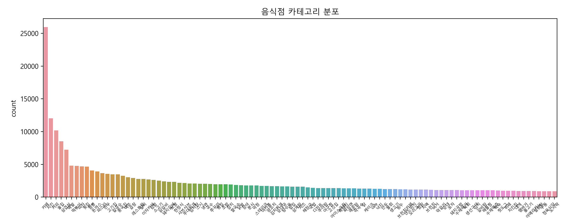
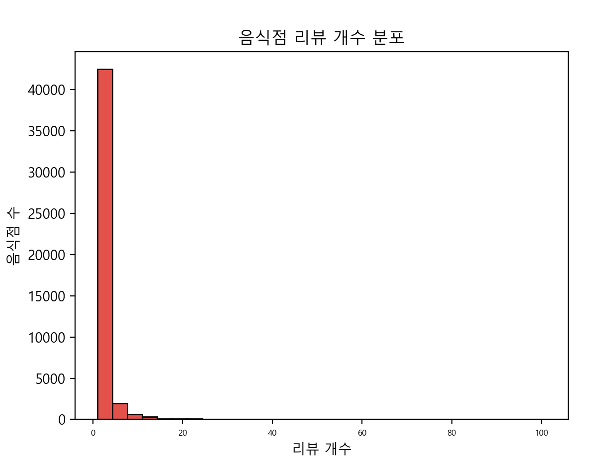
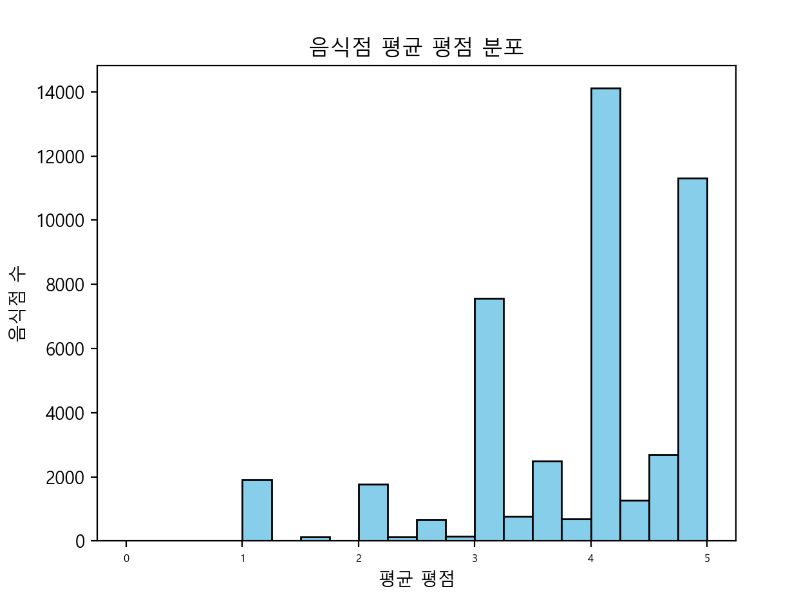
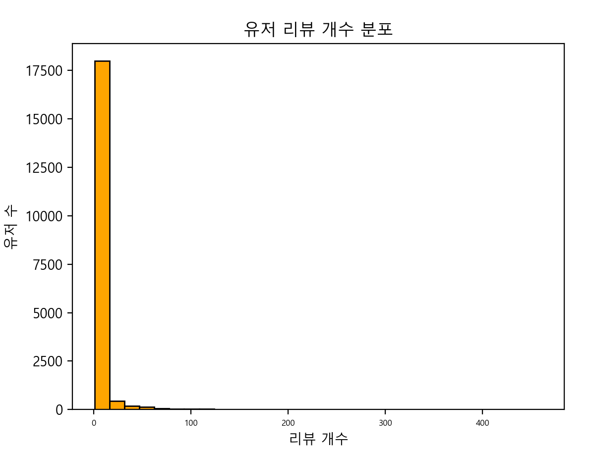
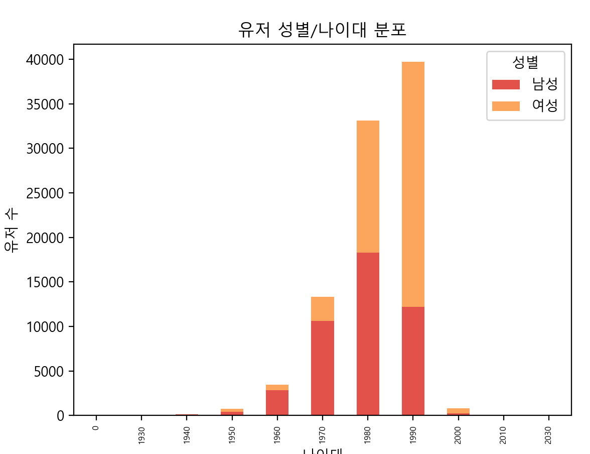

# 250306 DAY3 개인 과제 및 실습

## 명세서 과제 실습 - Rep 3. 데이터 시각화(visualize.py)

- 다양한 데이터의 출력값들을 그래프로 나타내기

```
import itertools
from collections import Counter
from parse import load_dataframes
import pandas as pd
import seaborn as sns
import matplotlib.pyplot as plt
import matplotlib.font_manager as fm
import folium


def set_config():
    # 폰트, 그래프 색상 설정
    font_list = fm.findSystemFonts(fontpaths=None, fontext="ttf")
    if any(["notosanscjk" in font.lower() for font in font_list]):
        plt.rcParams["font.family"] = "Noto Sans CJK JP"
    else:
        if not any(["malgun" in font.lower() for font in font_list]):
            raise Exception(
                "Font missing, please install Noto Sans CJK or Malgun Gothic. If you're using ubuntu, try `sudo apt install fonts-noto-cjk`"
            )

        plt.rcParams["font.family"] = "Malgun Gothic"

    sns.set_palette(sns.color_palette("Spectral"))
    plt.rc("xtick", labelsize=6)


def show_store_categories_graph(dataframes, n=100):
    """
    Tutorial: 전체 음식점의 상위 `n`개 카테고리 분포를 그래프로 나타냅니다.
    """

    stores = dataframes["stores"]

    # 모든 카테고리를 1차원 리스트에 저장합니다
    categories = stores.category.apply(lambda c: c.split("|"))
    categories = itertools.chain.from_iterable(categories)

    # 카테고리가 없는 경우 / 상위 카테고리를 추출합니다
    categories = filter(lambda c: c != "", categories)
    categories_count = Counter(list(categories))
    best_categories = categories_count.most_common(n=n)
    df = pd.DataFrame(best_categories, columns=["category", "count"]).sort_values(
        by=["count"], ascending=False
    )

    # 그래프로 나타냅니다
    chart = sns.barplot(x="category", y="count", data=df)
    chart.set_xticklabels(chart.get_xticklabels(), rotation=45)
    plt.title("음식점 카테고리 분포")
    plt.show()


def show_store_review_distribution_graph(dataframes):
    """
    Req. 1-3-1 전체 음식점의 리뷰 개수 분포를 그래프로 나타냅니다.
    """
    # 각 음식점별 리뷰 개수를 계산
    stores_reviews = dataframes["reviews"].groupby("store").size()

    # 히스토그램을 생성하여 출력
    plt.hist(stores_reviews, bins=30, edgecolor="black")
    plt.xlabel("리뷰 개수")
    plt.ylabel("음식점 수")
    plt.title("음식점 리뷰 개수 분포")
    plt.show()


def show_store_average_ratings_graph(dataframes):
    """
    Req. 1-3-2 각 음식점의 평균 평점을 그래프로 나타냅니다.
    """
    # 각 음식점별 평균 평점을 계산
    stores_reviews = dataframes["reviews"].groupby("store")["score"].mean()

    # 히스토그램을 생성하여 출력
    plt.hist(stores_reviews, bins=20, edgecolor="black", color="skyblue")
    plt.xlabel("평균 평점")
    plt.ylabel("음식점 수")
    plt.title("음식점 평균 평점 분포")
    plt.show()


def show_user_review_distribution_graph(dataframes):
    """
    Req. 1-3-3 전체 유저의 리뷰 개수 분포를 그래프로 나타냅니다.
    """
    # 각 유저별 작성한 리뷰 개수를 계산
    user_reviews = dataframes["reviews"].groupby("user").size()

    # 히스토그램을 생성하여 출력
    plt.hist(user_reviews, bins=30, edgecolor="black", color="orange")
    plt.xlabel("리뷰 개수")
    plt.ylabel("유저 수")
    plt.title("유저 리뷰 개수 분포")
    plt.show()


def show_user_age_gender_distribution_graph(dataframes):
    """
    Req. 1-3-4 전체 유저의 성별/나이대 분포를 그래프로 나타냅니다.
    """
     # 유저의 나이를 10년 단위로 그룹화
    users = dataframes["users"]
    users["age"] = pd.to_numeric(users["age"], errors="coerce")  # 문자열 → 숫자로 변환
    users["age_group"] = (users["age"] // 10) * 10  # 10년 단위로 그룹화

    # 나이대별 성별 인원 수를 계산하여 그래프를 생성
    df = users.groupby(["age_group", "gender"]).size().unstack()
    df.plot(kind="bar", stacked=True)
    plt.xlabel("나이대")
    plt.ylabel("유저 수")
    plt.title("유저 성별/나이대 분포")
    plt.legend(title="성별", labels=["남성", "여성"])
    plt.show()

def show_stores_distribution_graph(dataframes):
    """
    Req. 1-3-5 각 음식점의 위치 분포를 지도에 나타냅니다.
    """
    # 음식점과 리뷰 데이터를 병합하여 필터링 기준 적용
    stores = dataframes["stores"]
    reviews = dataframes["reviews"]
    stores_reviews = reviews.groupby("store").agg(review_count=("score", "count"), avg_score=("score", "mean"))
    merged_stores = stores.merge(stores_reviews, left_on="id", right_index=True)
    filtered_stores = merged_stores[(merged_stores["area"].str.contains(region)) &
                                    (merged_stores["review_count"] >= min_reviews) &
                                    (merged_stores["avg_score"] >= min_score)]

    # 지도 중심을 설정하고 마커를 추가
    map_center = [filtered_stores["latitude"].mean(), filtered_stores["longitude"].mean()]
    m = folium.Map(location=map_center, zoom_start=12)

    for _, row in filtered_stores.iterrows():
        folium.Marker(
            location=[row["latitude"], row["longitude"]],
            popup=f"{row['store_name']}\n평점: {row['avg_score']:.1f} 리뷰: {row['review_count']}",
            tooltip=row["store_name"]
        ).add_to(m)

    return m


def main():
    set_config()
    data = load_dataframes()
    show_store_categories_graph(data)
    show_store_review_distribution_graph(data)
    show_store_average_ratings_graph(data)
    show_user_review_distribution_graph(data)
    show_user_age_gender_distribution_graph(data)
    store_map = show_stores_distribution_graph(data)
    store_map.save("store_map.html")
    print("[+] 음식점 위치 지도 저장 완료: store_map.html")


if __name__ == "__main__":
    main()

```






